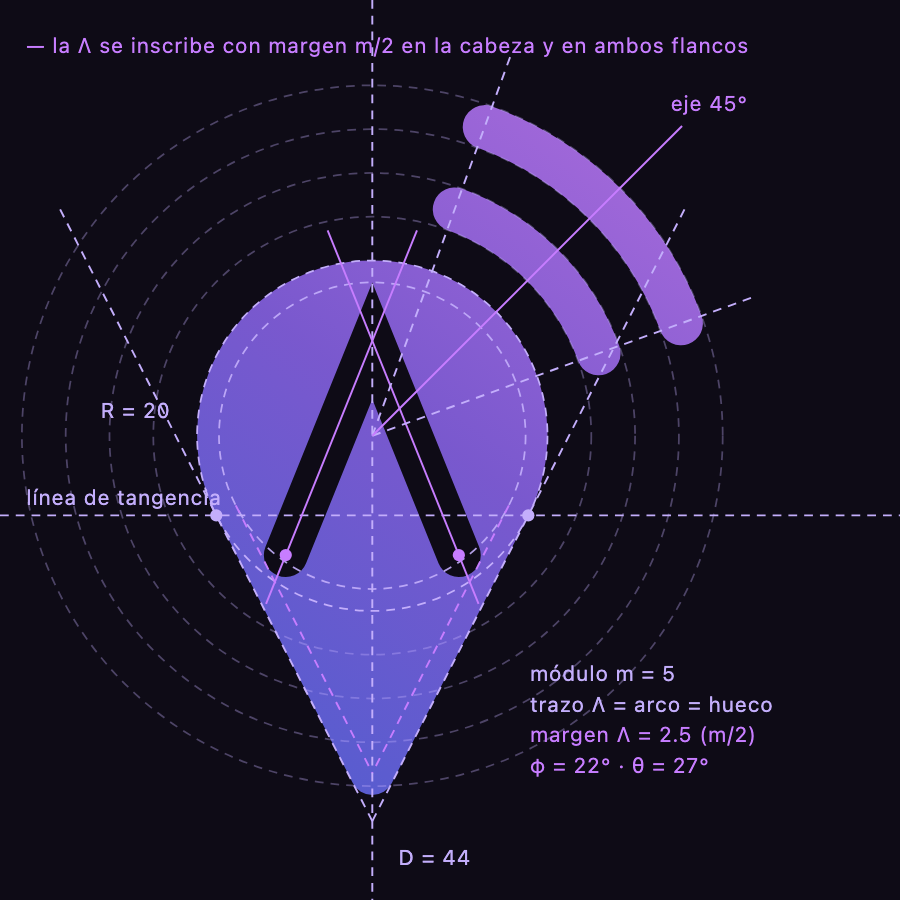

# Marca AMO

Guía de identidad visual de **AMO — Advertising Market Optimization**, el marketplace que conecta anunciantes con medios hiperlocales. Es la fuente de verdad para diseño, desarrollo y cualquier pieza que salga con la marca.

- Activos listos para usar: [`public/brand/`](../public/brand)
- Componentes React: [`src/components/brand/`](../src/components/brand)
- Generador (geometría y logotipo en código): [`scripts/brand/`](../scripts/brand). Se regenera con `pnpm brand:build`.
- Lámina de verificación: [`scripts/brand/salida/lamina.png`](../scripts/brand/salida/lamina.png). Diagrama de construcción: [`scripts/brand/salida/construccion.png`](../scripts/brand/salida/construccion.png).

> Los SVG, PNG, `icon.svg`, `favicon.ico` y `trazos.ts` son **generados**. No se editan a mano: se cambian los parámetros en `scripts/brand/*.ts` y se ejecuta `pnpm brand:build`.

---

## 1. Concepto

El isotipo junta tres ideas en una sola forma:

| Elemento                 | Qué dice                                                                                   |
| ------------------------ | ------------------------------------------------------------------------------------------ |
| **Pin de ubicación**     | Lo hiperlocal: cada pauta ocurre en un lugar concreto (un barrio, un municipio, un medio). |
| **Λ calada en el pin**   | La **A** de AMO y, a la vez, una flecha ascendente: optimización y crecimiento.            |
| **Dos arcos de emisión** | Los medios y su alcance: la señal que sale del lugar hacia la audiencia.                   |

El pin es **una sola pieza** con la Λ calada como contraforma, así que la silueta de ubicación queda intacta y se reconoce incluso a 16 px. La Λ y los arcos se dibujan con **el mismo trazo**: la A en negativo dentro del pin y la señal en positivo fuera de él son el mismo gesto.

El logotipo es la palabra **amo** en minúsculas: cercana, fácil de decir y con un guiño en español (_amo_ = «yo amo»). Las minúsculas bajan el tono corporativo sin perder solidez gracias al peso ExtraBold.

## 2. Construcción del isotipo



Todo sale de la cabeza del pin y de un **módulo `m`**. Los valores viven en `scripts/brand/isotipo.ts` (`ISOTIPO_PRINCIPAL`):

| Parámetro                    | Valor | Regla                                                                                           |
| ---------------------------- | ----- | ----------------------------------------------------------------------------------------------- |
| Radio de la cabeza `R`       | 20    | Unidad base del sistema.                                                                        |
| Distancia centro → punta `D` | 44    | Los flancos son **tangentes** a la cabeza. El semiángulo de la punta es θ = asin(R/D) ≈ 27°.    |
| Módulo `m`                   | 5     | Ancho del trazo de la Λ, grosor de cada arco y separación cabeza–arco y arco–arco.              |
| Margen de la Λ               | 2,5   | `m/2`. Material entre la Λ y el borde del pin, igual arriba y en los dos flancos.               |
| Semiángulo de la Λ `φ`       | 22°   | Más cerrado que la punta (θ ≈ 27°): se lee como letra A y no como un tejado.                    |
| Arcos                        | 50°   | Concéntricos a la cabeza, entre los radios de 20° y 70° (bisectriz a 45°, arriba a la derecha). |
| Redondeos                    | 2,5   | Punta del pin. Pies de la Λ y remates de los arcos: semicírculos de diámetro `m`.               |

Reglas de construcción:

1. **Una sola pieza.** La Λ es una contraforma: se recorre en sentido contrario a la silueta (regla de relleno `nonzero`), sin máscaras ni recortes. Funciona igual en navegadores, satori (iconos e imagen OG) e impresión.
2. **La Λ se inscribe con margen constante.** Su vértice queda a `m/2` del borde superior de la cabeza y cada pie redondo, a `m/2` de su flanco. El tamaño de la A no es arbitrario: es la mayor Λ de ángulo φ que cabe en el pin con ese margen.
3. **Un solo trazo.** Λ, arcos y huecos miden `m`: cabeza, hueco, arco, hueco, arco (radios 20 · 25–30 · 35–40).
4. **Eje de emisión a 45°** (arriba a la derecha). El remate de la «a» del logotipo se corta perpendicular a ese eje.
5. **Gradiente en diagonal ascendente**, del índigo (el lugar, abajo) a la orquídea (la señal, arriba).

### Versión compacta (16–24 px)

`ISOTIPO_COMPACTO`: un solo arco, módulo 7 (margen 3,5), Λ más abierta (φ = 24°) y punta algo más corta (D = 42). A 16 px el segundo arco y un trazo de 5 unidades se empastan. El componente `<Isotipo>` cambia solo a la versión compacta cuando `size ≤ 24`. El favicon (`src/app/icon.svg`) y los tamaños de `favicon.ico` también la usan.

## 3. Logotipo

- **Fuente base:** Plus Jakarta Sans ExtraBold (SIL Open Font License 1.1, copia en `scripts/brand/fuentes/OFL.txt`). En los SVG se convierte en trazados, así que no necesita la fuente instalada.
- **Ajustes a mano** (`scripts/brand/logotipo.ts`):
  1. La **m** se condensa 16 unidades por contraforma sin tocar el grosor de las astas. Así las tres letras quedan con un color tipográfico parejo.
  2. El **remate de la a** se corta a 45°, perpendicular al eje de emisión del isotipo, sin cerrar la boca de la letra.
  3. **Espaciado óptico cerrado:** a→m 62 u, m→o 44 u (distancia entre cajas de tinta).
- **Descriptor:** «ADVERTISING MARKET OPTIMIZATION» en Plus Jakarta Sans SemiBold, mayúsculas, tracking +0,16 em.
  - **Horizontal:** en tres líneas a la derecha de un filete vertical. El bloque mide exactamente la x-height de «amo».
  - **Vertical:** en una línea bajo la palabra, 1,5 veces su ancho.
- **Composición horizontal:** el isotipo mide 1,9 veces la x-height de «amo», la punta del pin se apoya en la línea base (con el mismo sobrepaso que la «o») y la separación entre los arcos y la palabra es 0,3 x-height.

### Versiones y archivos

| Versión                   | Archivo (fondo oscuro / claro)                                                                                             | Uso                                                                 |
| ------------------------- | -------------------------------------------------------------------------------------------------------------------------- | ------------------------------------------------------------------- |
| Horizontal                | `amo-logo-horizontal-oscuro.svg` / `-claro.svg`                                                                            | Barra lateral, encabezados, correos. Versión por defecto.           |
| Horizontal con descriptor | `amo-logo-horizontal-descriptor-oscuro.svg` / `-claro.svg`                                                                 | Portadas, PDF, presentaciones.                                      |
| Vertical con descriptor   | `amo-logo-vertical-oscuro.svg` / `-claro.svg`                                                                              | Pantalla de ingreso, splash, piezas cuadradas.                      |
| Vertical simple           | `amo-logo-vertical-simple-oscuro.svg` / `-claro.svg`                                                                       | Espacios verticales donde el descriptor no se lee.                  |
| Monocromo                 | `amo-logo-mono.svg` (`currentColor`), `<Logotipo variante="mono">`                                                         | Grabados, sellos, fondos fotográficos o de color.                   |
| Isotipo                   | `amo-isotipo.svg` (Aurora), `amo-isotipo-profundo.svg` (fondos claros), `amo-isotipo-mono.svg`, `amo-isotipo-compacto.svg` | Avatares, favicon, marca de agua.                                   |
| Icono de app              | `amo-app-icon.svg`, `amo-icon-192.png`, `amo-icon-512.png`, `amo-icon-maskable-512.png`                                    | PWA/manifiesto. `apple-icon` se genera en `src/app/apple-icon.tsx`. |

En los archivos, **«oscuro» y «claro» nombran el fondo** sobre el que va el logo, no el color del logo. Lo mismo vale para la prop `tono` de los componentes.

## 4. Zona de protección y tamaños mínimos

**Zona de protección = X**, donde X es el radio de la cabeza del pin en el tamaño en que se use el logo. En el logo horizontal equivale a casi media x-height de «amo» (0,45); en el isotipo solo, a casi un cuarto de su alto (24 %). Dentro de esa zona no puede haber texto, bordes ni otros logos.

| Versión                   | Mínimo digital                             | Mínimo impreso |
| ------------------------- | ------------------------------------------ | -------------- |
| Isotipo principal         | 24 px de alto (por debajo usa el compacto) | 8 mm           |
| Isotipo compacto          | 16 px                                      | 5 mm           |
| Horizontal                | 24 px de alto                              | 8 mm           |
| Horizontal con descriptor | 64 px de alto                              | 20 mm          |
| Vertical simple           | 64 px de alto                              | 18 mm          |
| Vertical con descriptor   | 120 px de alto                             | 30 mm          |

## 5. Color

### Paleta Lila AMO

| Token      | HEX       | Uso principal                                                           |
| ---------- | --------- | ----------------------------------------------------------------------- |
| `lila-50`  | `#F6F3FF` | Palabra «amo» sobre fondo oscuro, fondos de resaltado en claro.         |
| `lila-100` | `#EDE7FE` | Texto sobre superficies lila en oscuro, estados seleccionados en claro. |
| `lila-200` | `#DCD0FD` | Bordes y fondos de chips en claro.                                      |
| `lila-300` | `#C3AEFB` | Descriptor sobre fondo oscuro, texto de énfasis en oscuro.              |
| `lila-400` | `#A788F6` | **Primario en tema oscuro** (botones, foco, enlaces).                   |
| `lila-500` | `#8C66EE` | Color núcleo de la marca, centro del gradiente Aurora.                  |
| `lila-600` | `#7549DE` | **Primario en tema claro**, primera serie de gráficos.                  |
| `lila-700` | `#6238BF` | Descriptor sobre fondo claro, hover del primario claro.                 |
| `lila-800` | `#4F2F98` | Texto de acento sobre fondos lila claros.                               |
| `lila-900` | `#3F2A76` | Superficies de marca profundas.                                         |
| `lila-950` | `#261848` | Palabra «amo» sobre fondo claro (en lugar de negro).                    |

### Neutros tintados (mauve)

| Rol                | Oscuro (tema principal) | Claro     |
| ------------------ | ----------------------- | --------- |
| Fondo              | `#0E0B16`               | `#FAF9FD` |
| Superficie         | `#15111F`               | `#FFFFFF` |
| Superficie elevada | `#1C1729`               | `#FFFFFF` |
| Borde              | `#2A2338`               | `#E7E3F0` |
| Texto              | `#F2EFFA`               | `#1B1528` |
| Texto secundario   | `#A59EB8`               | `#615A75` |

Los colores semánticos (éxito, advertencia, información, destructivo) y las paletas de gráficos viven como tokens en `src/app/globals.css`. Los gráficos usan HEX porque Chart.js no entiende `oklch()`.

### Gradiente Aurora

| Variante            | Paradas (0 → 50 % → 100 %)        | Cuándo                                                     |
| ------------------- | --------------------------------- | ---------------------------------------------------------- |
| **Aurora**          | `#5B6CF0` → `#8C66EE` → `#C77DFF` | Isotipo sobre fondos oscuros.                              |
| **Aurora profunda** | `#4453D6` → `#7549DE` → `#9B4FE0` | Isotipo sobre fondos claros (contraste ≥ 4,3:1).           |
| **Aurora icono**    | `#5B6CF0` → `#8C66EE` → `#B06CF0` | Fondo de iconos con el isotipo en blanco (blanco ≥ 3,3:1). |

- **Dirección:** diagonal ascendente, 45° (abajo-izquierda → arriba-derecha). En CSS: `linear-gradient(45deg, …)`. En SVG: `gradientUnits="userSpaceOnUse"` desde la esquina inferior izquierda de la caja del isotipo hasta la superior derecha, para que las piezas compartan un solo gradiente continuo.
- **Superficies de interfaz:** el token `--aurora` de `globals.css` (lila → índigo con un destello orquídea radial arriba a la derecha) es la versión para fondos de UI: hero de ingreso, tarjetas destacadas, estados vacíos. El texto con gradiente usa `--aurora-texto`.
- La Aurora es un acento: no se usa en texto de párrafo, tablas ni botones secundarios.

Las constantes en código viven en `src/components/brand/colores.ts` (`LILA`, `NEUTRO`, `AURORA`, `AURORA_PROFUNDA`, `AURORA_ICONO`, `TINTA`).

## 6. Tipografía

| Familia               | Rol                                      | Pesos   | Token                               |
| --------------------- | ---------------------------------------- | ------- | ----------------------------------- |
| **Plus Jakarta Sans** | Títulos, cifras destacadas, marca        | 600–800 | `--font-heading` (`--font-jakarta`) |
| **Geist**             | Interfaz: texto, formularios, tablas     | 400–600 | `--font-sans`                       |
| **Geist Mono**        | Códigos, identificadores, datos técnicos | 400–500 | `--font-mono`                       |

Las tres familias se sirven desde el repositorio (`src/app/fuentes/`, variables, subconjunto `latin`) con `next/font/local`: ni el desarrollo ni la compilación dependen de alcanzar Google Fonts. Origen, licencia y cómo actualizarlas, en el `README.md` de esa carpeta.

Jerarquía de referencia (escritorio; en móvil un paso menos):

| Nivel       | Tamaño / interlínea          | Familia y peso | Tracking  |
| ----------- | ---------------------------- | -------------- | --------- |
| Display     | 48/56                        | Jakarta 800    | −0,02 em  |
| H1          | 32/40                        | Jakarta 700    | −0,015 em |
| H2          | 24/32                        | Jakarta 700    | −0,01 em  |
| H3          | 20/28                        | Jakarta 600    | 0         |
| Cuerpo      | 14/20 (UI) · 16/24 (lectura) | Geist 400      | 0         |
| Etiqueta    | 12/16                        | Geist 500      | +0,01 em  |
| Sobretítulo | 11/16 mayúsculas             | Geist 600      | +0,08 em  |

Las cifras en tablas, KPI y montos usan `tabular-nums` para que las columnas se alineen. La moneda se muestra en COP y es-CO: `$ 1.250.000`, sin decimales.

## 7. Usos correctos e incorrectos

**Sí**

- Usar la versión oscura o clara según el fondo, o `tono="auto"` en la interfaz.
- Mantener la zona de protección y los tamaños mínimos.
- Usar el isotipo solo cuando la marca ya está presente (favicon, avatar, carga).
- Usar la versión monocroma sobre fotos o fondos de color, en blanco o en `lila-950`.

**No**

- Deformar, rotar o inclinar el logo, ni cambiar la proporción entre isotipo y palabra.
- Recolorear las piezas por separado o poner el gradiente en la palabra «amo».
- Añadir sombras, contornos, biseles o brillos.
- Reescribir «amo» con la fuente o cambiar el espaciado. Siempre se usan los trazados.
- Escribir «AMO» en mayúsculas como logotipo (sí se escribe así en el texto corrido).
- Poner el isotipo en color sobre fondos lila o Aurora: ahí va en blanco.
- Girar el isotipo para «apuntar» a otra dirección: la emisión siempre va arriba a la derecha.
- Usar el isotipo principal por debajo de 24 px.

## 8. Iconografía

- **Librería:** `lucide-react` v1, con los nombres nuevos (`CircleCheck`, no `CheckCircle`). No se usan iconos de marcas de terceros.
- **Tamaños:** 16 px en tablas y chips, 20 px en navegación y botones, 24 px en encabezados y estados vacíos.
- **Trazo:** 2 px por defecto y 1,75 px a partir de 24 px. Siempre `currentColor`: el icono hereda el color del texto.
- Un icono acompaña a una etiqueta, no la reemplaza. Si va solo (botón de icono), lleva `aria-label` y _tooltip_.
- Metáforas de dominio: `MapPin` (medio, cobertura), `Megaphone` (campaña), `Radio` (alcance), `Wallet` (liquidación), `ShieldCheck` (seguridad y roles).

## 9. Tono de voz

Hablamos **español de Colombia, cercano y profesional**, y tratamos de **tú** en la interfaz.

- **Claro antes que ingenioso.** «Tu campaña quedó programada» y no «¡Todo listo para brillar!».
- **Concreto.** Cifras, fechas y lugares reales: «3 medios en Bello y Envigado».
- **Activo y breve.** Botones con verbo: «Crear campaña», «Aprobar oferta», «Descargar Excel».
- **Errores útiles:** qué pasó y qué hacer. «No pudimos guardar los cambios. Revisa tu conexión e intenta de nuevo.» Sin culpar ni usar jerga técnica.
- **Confianza sin exagerar.** Nada de superlativos vacíos. La plataforma mide y liquida, así que el lenguaje también es preciso.
- **Términos de dominio** del glosario del proyecto: campaña, oferta, cupo, asignación, liquidación, medio, anunciante.

## 10. Movimiento

| Duración   | Uso                                                                   | Curva                                                            |
| ---------- | --------------------------------------------------------------------- | ---------------------------------------------------------------- |
| **150 ms** | Microinteracciones: hover, pulsación, cambio de color, _toggles_.     | `ease-out`                                                       |
| **250 ms** | Componentes: menús, popovers, tooltips, acordeones, cambio de vista.  | `--ease-suave` `cubic-bezier(.22, 1, .36, 1)`                    |
| **400 ms** | Entradas de página, diálogos, aparición escalonada, relleno del logo. | `--ease-suave`; entradas de trazo `cubic-bezier(.65, 0, .35, 1)` |

- El movimiento **explica**: de dónde viene algo y adónde va. No decora.
- Las salidas son más cortas que las entradas (unos 2/3).
- Los escalonados usan 40–60 ms entre elementos y un máximo de 6 elementos animados.
- **`LogoAnimado`** dibuja el contorno del pin en 900 ms, rellena el pin con la Λ calada en 400 ms y hace pulsar los arcos en onda (1,6 s, desfase 220 ms). Se usa en ingreso y splash, nunca dentro de la app.
- **Giro del globo** (explorador geográfico, solo en la vista mundial): el planeta gira sobre su eje hacia el este, una vuelta cada 3 min, con arranque y frenado suaves. Es ambiental y nunca compite con la lectura: se detiene al arrastrar, acercar, apuntar a un país o tener uno elegido, y reanuda solo; hay un botón para pausarlo (la elección se recuerda) y no existe con movimiento reducido. Modelo y constantes en `src/components/maps/giro-globo.ts`.
- **Movimiento reducido:** con `prefers-reduced-motion` se desactivan los desplazamientos y los bucles. `LogoAnimado` muestra el isotipo estático (resuelto en CSS, sin desajustes de hidratación) y `MotionConfig reducedMotion="user"` aplica la regla al resto.

## 11. Accesibilidad de color

Contrastes WCAG 2.2 medidos:

| Par                                                          | Contraste       | Resultado     |
| ------------------------------------------------------------ | --------------- | ------------- |
| Primario oscuro `#A788F6` sobre `#0E0B16`                    | 6,95:1          | AA texto      |
| Primario claro `#7549DE` sobre `#FAF9FD`                     | 5,32:1          | AA texto      |
| Blanco sobre `#7549DE` (botón primario claro)                | 5,58:1          | AA texto      |
| `#160F29` sobre `#A788F6` (botón primario oscuro)            | 6,61:1          | AA texto      |
| Palabra `#F6F3FF` sobre `#0E0B16`                            | 17,79:1         | AAA           |
| Palabra `#261848` sobre `#FAF9FD`                            | 15,33:1         | AAA           |
| Descriptor `#C3AEFB` sobre `#0E0B16`                         | 9,99:1          | AAA           |
| Descriptor `#6238BF` sobre `#FAF9FD`                         | 7,06:1          | AAA           |
| Texto secundario `#A59EB8` / `#615A75`                       | 7,59:1 / 6,21:1 | AA            |
| Aurora sobre `#0E0B16` (parada más oscura `#5B6CF0`)         | 4,50:1          | ≥ 3:1 gráfico |
| Aurora profunda sobre `#FAF9FD` (parada más clara `#9B4FE0`) | 4,37:1          | ≥ 3:1 gráfico |
| Blanco sobre Aurora icono (parada más clara `#B06CF0`)       | 3,36:1          | ≥ 3:1 gráfico |

Reglas:

- La Aurora normal **no va sobre fondos claros**: su orquídea da 2,57:1. Ahí se usa la Aurora profunda. `tono="auto"` lo resuelve solo.
- El color nunca es la única señal: estados y series llevan también icono, texto o patrón.
- El foco visible usa `--ring` (primario del tema) con 2 px de anillo y separación.

## 12. Uso en código

```tsx
import { Isotipo } from "@/components/brand/isotipo"
import { Logotipo } from "@/components/brand/logotipo"
import { LogoAnimado } from "@/components/brand/logo-animado"
import { MarcaAgua } from "@/components/brand/marca-agua"

<Logotipo alto={28} />                                     // barra lateral, sigue el tema
<Logotipo orientacion="vertical" conDescriptor alto={160} /> // ingreso
<Logotipo tono="oscuro" />                                   // sobre un hero oscuro fijo
<Logotipo variante="mono" className="text-white" />          // sobre foto, lila o Aurora
<Isotipo size={20} />                                        // pasa a la versión compacta sola
<Isotipo size={32} variante="mono" className="text-white" />
<Isotipo size={24} decorativo />                             // junto a un texto que ya dice «AMO»
<LogoAnimado size={120} />                                   // splash de carga (client component)
<MarcaAgua className="absolute -right-24 -bottom-24 size-[28rem]" />
```

- `Isotipo` y `Logotipo` funcionan como Server Components. Usan `useId` para que los ids de gradiente no choquen cuando hay varios logos en la misma página. Los SVG de `public/brand/` también llevan un id de gradiente distinto por archivo.
- `tono="auto"` (por defecto) pinta con las tintas y la Aurora de marca del tema activo: cada color viaja en variables CSS y la variante `dark:` elige, sin JavaScript ni desajustes de hidratación.
- Llevan `role="img"` y `aria-label="AMO"`. `decorativo` y `MarcaAgua` se ocultan a los lectores de pantalla.
- Iconos de la app en Next: `src/app/icon.svg` (favicon SVG que cambia con `prefers-color-scheme`), `favicon.ico` (16/32/48), `apple-icon.tsx` (180 × 180), `opengraph-image.tsx` (1200 × 630) y `manifest.ts` (PWA, `start_url: /inicio`).
